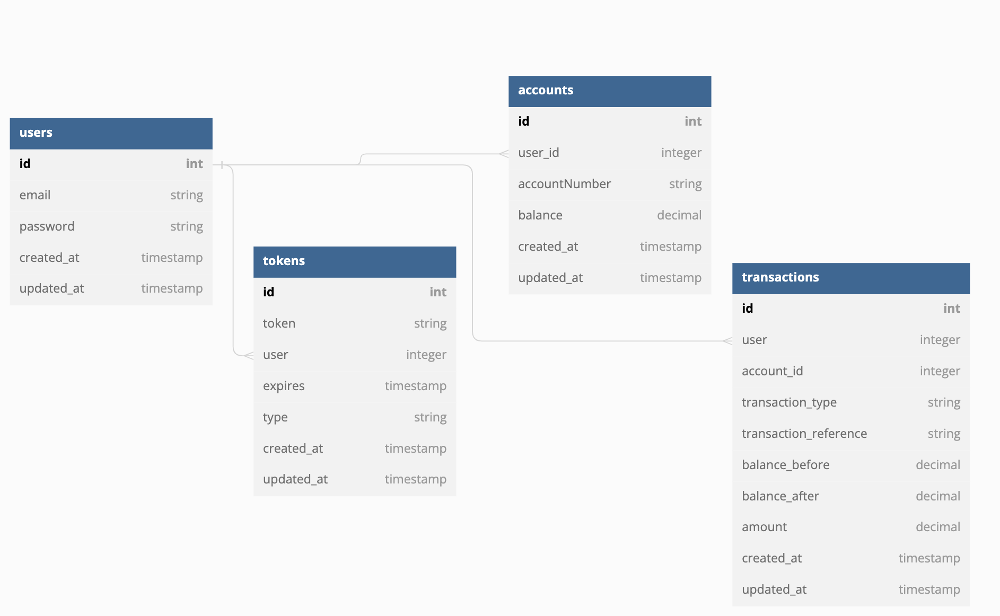

# **Backend Engineer Assessment**

#### **Submission Links**

- Postman Documentation: [Click Here](https://documenter.getpostman.com/view/5622145/2s8YsxvBW7)
- API Production Link: [Click here](https://lendsqrvectormike.herokuapp.com/)
- Github Repository: [Click here](https://github.com/Vectormike/glowing-memory)

---

## **Major features and Implementation**

These features are limited to:

- Accounts
- Deposits
- Transfers
- Withdrawals
- Transactions

### **Account:**

This features also refers to the Wallet of the said user, which holds user information and available balance.

### **Deposit:**

With this, the user is able to deposit/fund their account which the value will be reflected in the available balance.

### **Transfer:**

This makes an authorized user to be able to move monetary alue from its accounts to another user.

### **Withdrawal Feature:**

Since we have the monetary value stored in an account, the user can decided to withdraw to a physical bank account.



### API Endpoints

List of available routes:

**Auth routes**:\
`POST /api/auth/register` - register\
`POST /api/auth/login` - login\

**Account routes**:\
`POST /api/account/deposit` - fund\
`POST /api/account/transfer` - transfer\
`POST /api/account/withdraw` - withdraw\

## Environment Variables

The environment variables can be found and modified in the `.env` file. They come with these default values:

```bash
# Port number
NODE_ENV=development
PORT=8000
ACCESSTOKENEXPIRESMINUTES=1500
REFRESHTOKENEXPIRESDAYS=1
JWT_AUTH_SECRET=bananpieisasweetpie
DB_NAME=lendsqr
DB_USER=root
DB_PASSWORD=root
DB_HOST=localhost
DB_PORT=8889
DB_DIALECT=mysql
PAYSTACK_SECRET_KEY=
PAYSTACK_PUBLIC_KEY=
```

Clone the repo:

```bash
git clone https://github.com/Vectormike/glowing-memory lendsqr
cd lendsqr
```

Install the dependencies:

```bash
npm install
```

Set the environment variables:

```bash
cp .env.example .env

# open .env and modify the environment variables (if needed)
```

## Commands

Running locally:

```bash
npm run dev
```

Build:

```bash
npm run build
```

Running in production:

```bash
npm start
```
